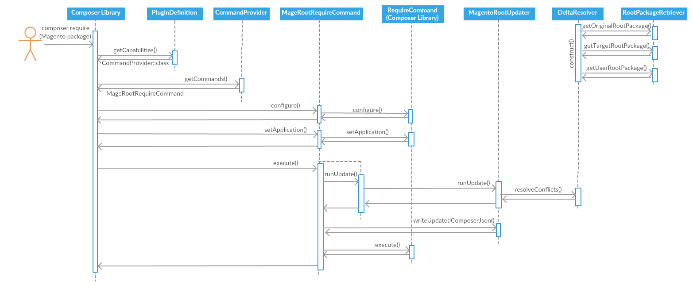
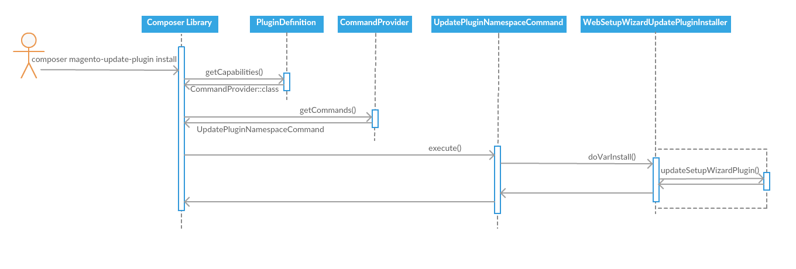

# Plugin operation flow explanations and diagrams

There are four paths through the plugin code that cover two main pieces of functionality:

 - Update the root `composer.json` file in a Magento installation with values required by the new Magento version during an upgrade
   - [composer require <magento_product_package>](#composer-require-magento_product_package)
 - Ensure the plugin is installed in the `<Magento>/var` directory, which is required for Magento's Web Setup Wizard upgrade path
   - [composer require/update magento/composer-root-update-plugin](#composer-requireupdate-magentocomposer-root-update-plugin)
   - [Magento module-based var installation](#magento-module-based-var-installation)
   - [Explicit var installation command](#explicit-var-installation-command)

***

## `composer require <magento_product_package>`

**Scenario:** The user has an installed Magento project and wants to upgrade to a new version. They call `composer require <magento_product_package>` from the command line or through the Magento Web Setup Wizard upgrade tool.

1. Composer boilerplate and plugin setup
   1. Composer sees the `"type": "composer-plugin"` value in the [composer.json](../src/Magento/ComposerRootUpdatePlugin/composer.json) file for the plugin package
   2. Composer reads the `"extra"->"class"` field to find the class that implements [PluginInterface](https://github.com/composer/composer/blob/master/src/Composer/Plugin/PluginInterface.php) ([PluginDefinition](class_descriptions.md#plugindefinition))
   3. `PluginDefinition` implements [Capable](https://github.com/composer/composer/blob/master/src/Composer/Plugin/Capable.php), telling Composer that it provides some capability ([CommandProvider](class_descriptions.md#commandprovider)), which is supplied through `PluginDefinition::getCapabilities()`
   4. `CommandProvider::getCommands()` supplies Composer with an instance of [MageRootRequireCommand](class_descriptions.md#commandsmagerootrequirecommand)
   5. Composer calls `MageRootRequireCommand::configure()` to obtain the command's name, description, options, and help text
      - `MageRootRequireCommand` extends Composer's native [RequireCommand](https://github.com/composer/composer/blob/master/src/Composer/Command/RequireCommand.php) and adds its own values to those in the existing implementation
      - Composer contains a command registry and rejects any new commands that have a conflicting name with a command that is already registered, so `MageRootRequireCommand::configure()` temporarily changes the command's name from `require` to a dummy value to bypass the registry check
   6. Composer calls `MageRootRequireCommand::setApplication()` after checking for naming conflicts but before adding the command to the registry, at which time the command name changes back to `require`
   7. Composer adds `MageRootRequireCommand` to the registry, overwriting the native `RequireCommand` as the command associated with the name `require`
2. Composer recognizes `require` as the command passed to the executable and finds `MageRootRequireCommand` as the command object registered under that name
3. Composer calls `MageRootRequireCommand::execute()`
4. `MageRootRequireCommand::execute()` backs up the user's `composer.json` file through [ExtendableRequireCommand::parseComposerJsonFile()](class_descriptions.md#extendablerequirecommand)
5. `MageRootRequireCommand::execute()` checks the `composer require` arguments for a `magento/product` package, and if it finds one it calls `MageRootRequireCommand::runUpdate()`
6. `MageRootRequireCommand::runUpdate()` calls [MagentoRootUpdater::runUpdate()](class_descriptions.md#magentorootupdater)
7. `MageRootRequireCommand::runUpdate()` calls [DeltaResolver::resolveRootDeltas()](class_descriptions.md#deltaresolver)
8. `DeltaResolver::resolveRootDeltas()` uses [RootPackageRetriever](class_descriptions.md#rootpackageretriever) to obtain the Composer [Package](https://github.com/composer/composer/blob/master/src/Composer/Package/Package.php) objects for the root `composer.json` files from the default installation of the existing edition and version, the target edition and version supplied to the `composer require` call, and the user's current installation including any customizations they have made 
9. `DeltaResolver::resolveRootDeltas()` iterates over the fields in `composer.json` to determine any values that need to be updated to match the root `composer.json` file of the new Magento edition/version
   1. To find these values, it compares the values for each field in the default project for the installed edition/version with the project for the target edition/version (`DeltaResolver::findResolution()`)
   2. If a value has changed in the target, it checks that field in the user's customized root `composer.json` file to see if it has been overwritten with a custom value
   3. If the user customized the value, the conflict will be resolved according to the specified resolution strategy: use the expected Magento value, use the user's custom value, or prompt the user to specify which value should be used
10. If `resolveRootDeltas()` found values that need to change, `MageRootRequireCommand::execute()` calls `MagentoRootUpdater::writeUpdatedComposerJson()` to apply those changes 
11. `MageRootRequireCommand::execute()` calls the native `RequireCommand::execute()` function, which will now use the updated root `composer.json` file if the plugin made changes
12. If the `RequireCommand::execute()` call fails after the plugin makes changes, `MageRootRequireCommand::execute()` calls `ExtendableRequireCommand::revertMageComposerFile()` to restore the `composer.json` file to its original state

***

## `composer require/update magento/composer-root-update-plugin`

**Scenario:** The user wants to install or update the version of the `magento/composer-root-update-plugin` package in their Magento installation. They call `composer require/update magento/composer-root-update-plugin`. The plugin needs to update a copy of itself in the `<Magento>/var` directory, where it is required for Web Setup Wizard operations.

1. Composer boilerplate and plugin setup
   1. Composer sees the `"type": "composer-plugin"` value in the `composer.json` file for the plugin package
   2. Composer reads the `"extra"->"class"` field to find the class that implements [PluginInterface](https://github.com/composer/composer/blob/master/src/Composer/Plugin/PluginInterface.php) ([PluginDefinition](class_descriptions.md#plugindefinition))
   3. `PluginDefinition` implements [EventSubscriberInterface](https://github.com/composer/composer/blob/master/src/Composer/EventDispatcher/EventSubscriberInterface.php), telling Composer that it subscribes to events triggered by Composer operations
   4. `PluginDefinition::getSubscribedEvents()` tells Composer to call the `PluginDefinition::packageUpdate()` function when the `POST_PACKAGE_INSTALL` or `POST_PACKAGE_UPDATE` events are triggered
2. Composer runs the [RequireCommand::execute()](https://github.com/composer/composer/blob/master/src/Composer/Command/RequireCommand.php) or [UpdateCommand::execute()](https://github.com/composer/composer/blob/master/src/Composer/Command/UpdateCommand.php) method as relevant, which results in Composer triggering either the `POST_PACKAGE_INSTALL` or `POST_PACKAGE_UPDATE` event
3. Composer checks the listeners registered to the triggered event and calls `PluginDefinition::packageUpdate()`
4. `PluginDefinition::packageUpdate()` calls [WebSetupWizardPluginInstaller::packageEvent()](class_descriptions.md#websetupwizardplugininstaller)
5. `WebSetupWizardPluginInstaller::packageEvent()` checks the event to see if it was triggered by a change to the `magento/composer-root-update-plugin` package, and if so it calls `WebSetupWizardPluginInstaller::updateSetupWizardPlugin()`
6. `WebSetupWizardPluginInstaller::updateSetupWizardPlugin()` checks the `<Magento>/var/vendor` directory for the `magento/composer-root-update-plugin` version installed there to see if it matches the version in the triggered event
7. If the version does not match or `magento/composer-root-update-plugin` is absent in `<Magento>/var/vendor`, `WebSetupWizardPluginInstaller::updateSetupWizardPlugin()` installs the new version of `magento/composer-root-update-plugin` in a temporary directory, then replaces `<Magento>/var/vendor` with the `vendor` directory from the temporary installation

***

## Magento module-based `var` installation

**Scenario:** The user calls the `bin/magento setup:uninstall` command, which clears the `<Magento>/var` directory, then runs `bin/magento setup:install`. The plugin needs to reinstall itself in the `<Magento>/var` directory, where it is required for Web Setup Wizard operations.

1. The `"autoload"->"files": "registration.php"` value in the plugin's [composer.json](../src/Magento/ComposerRootUpdatePlugin/composer.json) file causes [registration.php](../src/Magento/ComposerRootUpdatePlugin/registration.php) to be loaded by Magento
2. `registration.php` registers the plugin as the `Magento_ComposerRootUpdatePlugin` module so it can tie into the `bin/magento setup` module operations
3. Magento searches registered modules for any `Setup\InstallData`, `Setup\RecurringData`, or `Setup\UpgradeData` classes
4. Magento calls [InstallData::install()](class_descriptions.md#installdatarecurringdataupgradedata), [RecurringData::install()](class_descriptions.md#installdatarecurringdataupgradedata), or [UpgradeData::upgrade()](class_descriptions.md#installdatarecurringdataupgradedata) as appropriate (which one depends on the specific `bin/magento setup` command and installed Magento version), which then calls [WebSetupWizardPluginInstaller::doVarInstall()](class_descriptions.md#websetupwizardplugininstaller)
5. `WebSetupWizardPluginInstaller::doVarInstall()` finds the `magento/composer-root-update-plugin` version in the `composer.lock` file in the root Magento directory and calls `WebSetupWizardPluginInstaller::updateSetupWizardPlugin()`
6. `WebSetupWizardPluginInstaller::updateSetupWizardPlugin()` checks the `<Magento>/var/vendor` directory for the `magento/composer-root-update-plugin` version installed there (if any) to see if it matches the version in the root `composer.lock` file
7. If the version does not match or `magento/composer-root-update-plugin` is absent in `<Magento>/var/vendor`, `WebSetupWizardPluginInstaller::updateSetupWizardPlugin()` installs the root project's `magento/composer-root-update-plugin` version in a temporary directory, then replaces `<Magento>/var/vendor` with the `vendor` directory from the temporary installation

***

## Explicit `var` installation command

**Scenario:** The user clears the `<Magento>/var` directory and wants to use the Web Setup Wizard to upgrade their Magento installation. The plugin must exist in `<Magento>/var` for Web Setup Wizard operations, so the user calls `composer magento-update-plugin install` to restore the plugin installation in the `<Magento>/var` directory.

1. Composer boilerplate and plugin setup
   1. Composer sees the `"type": "composer-plugin"` value in the [composer.json](../src/Magento/ComposerRootUpdatePlugin/composer.json) file for the plugin package
   2. Composer reads the `"extra"->"class"` field to find the class that implements [PluginInterface](https://github.com/composer/composer/blob/master/src/Composer/Plugin/PluginInterface.php) ([PluginDefinition](class_descriptions.md#plugindefinition))
   3. `PluginDefinition` implements [Capable](https://github.com/composer/composer/blob/master/src/Composer/Plugin/Capable.php), telling Composer that it provides some capability ([CommandProvider](class_descriptions.md#commandprovider)), which is supplied through `PluginDefinition::getCapabilities()`
   4. `CommandProvider::getCommands()` supplies Composer with an instance of [UpdatePluginNamespaceCommands](class_descriptions.md#commandsupdatepluginnamespacecommands)
   5. Composer calls `UpdatePluginNamespaceCommands::configure()` to obtain the command's name, description, options, and help text
   6. Composer adds `UpdatePluginNamespaceCommands` to the registry under the name `magento-update-plugin`
2. Composer recognizes `magento-update-plugin` as the command passed to the executable and finds `UpdatePluginNamespaceCommands` as the command object registered under that name
3. Composer calls `UpdatePluginNamespaceCommands::execute()`
4. `UpdatePluginNamespaceCommands::execute()` checks the first argument supplied to the `composer magento-update-plugin` command and sees `install`, so it calls [WebSetupWizardPluginInstaller::doVarInstall()](class_descriptions.md#websetupwizardplugininstaller)
5. `WebSetupWizardPluginInstaller::doVarInstall()` finds the `magento/composer-root-update-plugin` version in the `composer.lock` file in the root Magento directory and calls `WebSetupWizardPluginInstaller::updateSetupWizardPlugin()`
6. `WebSetupWizardPluginInstaller::updateSetupWizardPlugin()` checks the `<Magento>/var/vendor` directory for the `magento/composer-root-update-plugin` version installed there (if any) to see if it matches the version in the root `composer.lock` file
7. If the version does not match or `magento/composer-root-update-plugin` is absent in `<Magento>/var/vendor`, `WebSetupWizardPluginInstaller::updateSetupWizardPlugin()` installs the root project's `magento/composer-root-update-plugin` version in a temporary directory then replaces `<Magento>/var/vendor` with the `vendor` directory from the temporary installation
